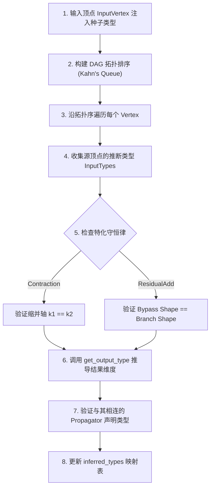

# 深度学习图式中间表示（FDIR）：受费曼规则启发的计算图理论、算法原理与工程实现指南

> **Feynman Diagrammatic Intermediate Representation (FDIR)**  
> **版本**：v1.0.0  
> **文档定位**：学术论文级理论推导 + 架构设计规约 + 工程代码实现 + API 使用手册  

---

## 目录

1. [引言与动机 (Motivation)](#1-引言与动机-motivation)
   - 1.1 公式、计算图与硬件代码之间的断层
   - 1.2 物理学革命的启示：量子场论与费曼图
   - 1.3 FDIR 的核心愿景：Diagram as Code
2. [理论建构与映射规约 (Theoretical Construction)](#2-理论建构与映射规约-theoretical-construction)
   - 2.1 费曼规则与深度学习 IR 的映射表
   - 2.2 传播子（Propagators）与状态线
   - 2.3 相互作用顶点（Interaction Vertices）
   - 2.4 指标缩并守恒律（Conservation Laws）
   - 2.5 作用量开销评估（Action Metric & Cost Model）
3. [算法原理与数学推导 (Algorithmic Principles)](#3-算法原理与数学推导-algorithmic-principles)
   - 3.1 拓扑序前向类型推导与守恒律校验算法
   - 3.2 基于活跃性分析（Liveness Analysis）的显存峰值计算算法
   - 3.3 基于 DAG 突变的图重写引擎（Rewrite Engine）
   - 3.4 下发（Lowering）与 PyTorch 执行图构建算法
4. [代码架构与工程实现 (Code Implementation)](#4-代码架构与工程实现-code-implementation)
   - 4.1 模块依赖关系与目录结构
   - 4.2 类型系统 (`types.py`) 的鲁棒性设计
   - 4.3 节点与顶点体系 (`nodes.py`)
   - 4.4 计算图容器 (`diagram.py`) 的 DAG 操作
   - 4.5 检查器 (`checker.py`)、评估器 (`cost.py`) 与下发器 (`lowering.py`)
5. [使用指南与 API 参考 (Usage Guide & API Manual)](#5-使用指南与-api-参考-usage-guide--api-manual)
   - 5.1 快速上手：构建 Transformer Self-Attention 模块
   - 5.2 静态维度守恒律校验
   - 5.3 评估物理开销与 Performance Report
   - 5.4 执行图重写优化（图融合与置换抵消）
   - 5.5 Lowering 为 PyTorch 模块并验证数值正确性
6. [总结与展望 (Conclusion & Future Work)](#6-总结与展望-conclusion--future-work)

---

## 1. 引言与动机 (Motivation)

### 1.1 公式、计算图与硬件代码之间的断层
在现代深度学习领域，神经网络架构的演进极其迅速。然而，**数学公式（Mathematics）**、**高层计算图（Framework Computation Graphs like PyTorch/JAX）** 与 **低层硬件指令（Compiler IRs & GPU Kernels like MLIR/Triton/CUDA）** 之间存在着深刻的语义断层：
- 论文中的公式（如 Scaled Dot-Product Attention）缺乏统一的类型约束和张量布局（Layout）表达；
- 开发者必须依靠经验编写命令式 PyTorch 代码，手动处理维度对齐与转置；
- 深度学习编译器（如 TVM, XLA）往往需要在大图生成后，依靠启发式 Pass 重新“猜”算子融合的最佳机会，难以直接利用公式层面的代数对称性。

### 1.2 物理学革命的启示：量子场论与费曼图
在 20 世纪 mid-20s，量子电动力学（QED）面临着相同的困局：复杂的微扰展开与高阶积分计算极其繁琐且极易出错。理查德·费曼（Richard Feynman）提出了**费曼图（Feynman Diagrams）**，这不仅是一种直观的可视化工具，更是一套严格的**图式计算规约（Diagrammatic Calculus）**：
- **外线（External Lines）**：指定了入态与出态粒子的物理状态；
- **内线/传播子（Propagators）**：传递虚拟粒子的内部状态；
- **顶点（Vertices）**：代表基本的物理相互作用，其顶点守恒律严格约束了能量-动量与量子数；
- **拓扑重写与对称性**：同一散射过程的不同拓扑表达可通过图等价重写（如 Crossing Symmetry）进行变换。

### 1.3 FDIR 的核心愿景：Diagram as Code
**FDIR (Feynman Diagrammatic Intermediate Representation)** 旨在将量子场论的图式代数思想引入深度学习编译栈。FDIR 提出：**计算图即费曼图，拓扑缩并即振幅计算，优化 pass 即规范重写**。研究者只需声明式的绘出模型的费曼图，编译器便能自动完成守恒律校验、开销评估、代数重写，并自动 Lower 为高性能硬件代码。

---

## 2. 理论建构与映射规约 (Theoretical Construction)

FDIR 在 theoretical physics 与 deep learning infrastructure 之间建立了精确的双射映射（Bijective Mapping）：

### 2.1 费曼规则与深度学习 IR 的映射表

| 物理概念 (QFT / Feynman Rules) | 深度学习 IR 概念 (FDIR) | 形式化定义 / 规范 |
| :--- | :--- | :--- |
| **External Lines（外线）** | 模型 Input / Output Tensor | $T^{(B, S, D)} \in \mathbb{R}^{B \times S \times D}$，显式指定维度与 Layout |
| **Propagators（传播子）** | 张量传输通道与残差 Bypass 通道 | 有向边 $e = (u, v, \tau, \text{layout})$，传输带有类型的张量状态 |
| **Vertices（相互作用顶点）** | 基础算子（Linear, Attn, Activation） | 局部相互作用映射 $\mathcal{V}: \prod \tau_{\text{in}} \to \tau_{\text{out}}$ |
| **Conservation Laws（守恒律）** | 指标缩并匹配与维度守恒 | 内部维度相约 $\sum_k A_{ik} B_{kj} \implies d_k^{(A)} \equiv d_k^{(B)}$ |
| **Amplitude $\mathcal{M}$（散射振幅）** | 缩并求值结果 Tensor | 沿 DAG 评估计算图得到的数值张量 |
| **Gauge Rewrites（规范重写）** | 保持语义的 Graph Rewrite | 算子融合、结合律重排、FlashAttention 折叠 |
| **Action $S[\phi]$（物理作用量）** | 执行开销与性能指标 | $\mathcal{S}(\mathcal{D}) = \alpha \cdot \text{FLOPs} + \beta \cdot \text{Bytes} + \gamma \cdot \text{Launches}$ |

---

### 2.2 传播子（Propagators）与状态线
传播子是连接顶点的有向边。每一个传播子包含唯一的 ID、源顶点、目标顶点，以及一个**强类型描述符 `TensorType`**：
$$ \tau = \langle \text{Shape}, \text{DType}, \text{Layout}, \text{Indices} \rangle $$
其中：
- $\text{Shape} = (d_1, d_2, \dots, d_r)$，支持具体整数（Concrete Int）与符号变量（Symbolic String，如 `"B"`, `"S"`, `"D"`）；
- $\text{Indices}$ 为 Einstein Notation（如 `'i'`, `'j'`），定义了该通道的指标命名。

### 2.3 相互作用顶点（Interaction Vertices）
顶点代表物理相互作用或数值算子。FDIR 预定义了五类核心顶点：
1. **ContractionVertex（缩并顶点）**：表达矩阵乘法 $\mathbf{A} \cdot \mathbf{B}$，执行简并指标 $k$ 的缩并；
2. **AttentionVertex（注意力相互作用顶点）**：表达 Rank-4 相互作用 $\text{Softmax}\left(\frac{\mathbf{Q}\mathbf{K}^T}{\sqrt{d_k}}\right)\mathbf{V}$；
3. **PointwiseVertex（逐元相互作用顶点）**：包含单目激活（GELU, ReLU, Softmax）与双目运算（Add, Mul, Sub）；
4. **ResidualVertex（残差 Bypass 顶点）**：表达旁路直连相加 $y = x \oplus \mathcal{F}(x)$；
5. **NormVertex（规范化顶点）**：表达 LayerNorm 或 RMSNorm 场场规范。

### 2.4 指标缩并守恒律（Conservation Laws）
指标缩并并非普通顶点，而是**约束整个物理图结构的拓扑守恒律**：
- **维度匹配守恒（Dimension Conservation）**：对任意缩并指标 $k$，必须满足 $d_k^{(\text{lhs})} == d_k^{(\text{rhs})}$；
- **残差旁路守恒（Residual Bypass Conservation）**：旁路通道 $x$ 的 Shape 必须与主分支 $\mathcal{F}(x)$ 的 Shape **严格全等**；
- **符号规范化（Symbolic Homomorphism）**：不同的符号变量名（如 `"D"` 与 `"H"`）在未绑定显式映射时，默认互斥不兼容。

---

## 3. 算法原理与数学推导 (Algorithmic Principles)

### 3.1 拓扑序前向类型推导与守恒律校验算法

FDIR 的静态检查器 `ShapeTypeChecker` 并不盲目相信用户在边上声明的类型，而是通过**拓扑序前向推演（Forward Type Propagation）**自动推断每个算子的真实输出类型，并与声明类型比对：



#### 算法伪代码：
```python
def check(diagram):
    sorted_vertices = diagram.topological_sort()
    inferred_types = {}
    
    # 1. 种子注入
    for v in sorted_vertices:
        if v.op_type == "Input":
            inferred_types[v.id] = v.attributes["tensor_type"]
            
    # 2. 拓扑推演
    for v in sorted_vertices:
        if v.op_type == "Input": continue
        input_types = [inferred_types[p.src_vertex_id] for p in v.inputs]
        
        # 守恒律校验
        v.validate_conservation_laws(input_types, env)
        
        # 维度推断
        out_type = v.get_output_type(input_types)
        inferred_types[v.id] = out_type
        
        # 边声明比对
        for p in v.outputs:
            assert out_type.is_compatible(p.tensor_type, env)
```

---

### 3.2 基于活跃性分析（Liveness Analysis）的显存峰值计算算法

单纯计算单个 Tensor 的最大 Size 无法真实反映 GPU 显存峰值。FDIR 实现了基于 DAG 拓扑序的**张量活跃性分析算法**：

1. **生成步（Production Step $\text{prod}[v]$）**：顶点 $v$ 在拓扑序中的位置 index；
2. **消亡步（Last Consumption Step $\text{last}[v]$）**：以 $v$ 的输出为输入的所有下游顶点中，拓扑序 index 的最大值：
   $$ \text{last}[v] = \max \{ \text{step}(u) \mid u \in \text{Consumers}(v) \} $$
3. **活跃区间（Live Range）**：在拓扑步 $t \in [\text{prod}[v], \text{last}[v]]$ 内，张量 $v$ 持续占用显存；
4. **时刻 $t$ 的总显存**：
   $$ M(t) = \sum_{v: \, \text{prod}[v] \le t \le \text{last}[v]} \text{SizeBytes}(v) $$
5. **峰值显存**：$M_{\text{peak}} = \max_t M(t)$。

---

### 3.3 基于 DAG 突变的图重写引擎（Rewrite Engine）

FDIR 的重写引擎支持**保语义的计算图拓扑突变**。以 **FlashAttention 融合 Pass** 为例：

#### 匹配模式（Pattern Match）：
搜索子图序列：`ContractionVertex` ($\mathbf{Q}\mathbf{K}^T$) $\to$ `PointwiseVertex` (Softmax) $\to$ `ContractionVertex` ($\mathbf{P}\mathbf{V}$)。

#### 图重构算法（Graph Mutation）：
1. 提取入线 $\mathbf{Q}, \mathbf{K}, \mathbf{V}$ 的源顶点与出线消费者节点集合 $\text{Consumers}$；
2. 在图容器中销毁原有的 3 个 Vertex 及其绑定的内部 Propagator；
3. 实例化新的 `AttentionVertex` 并插入图中；
4. 重新挂载入线：将 $\mathbf{Q}, \mathbf{K}, \mathbf{V}$ 的源节点连接到 `AttentionVertex`；
5. 重新挂载出线：将 `AttentionVertex` 连接到所有 $\text{Consumers}$。

```mermaid
graph LR
    subgraph 变换前 (Before Rewrite)
        Q --> QK["Contraction (QK^T)"]
        K --> QK
        QK --> Softmax["Softmax"]
        Softmax --> AttnV["Contraction (PV)"]
        V --> AttnV
        AttnV --> Out["Downstream"]
    end
    subgraph 变换后 (After Rewrite)
        Q_new["Q"] --> Fused["AttentionVertex (SDPA)"]
        K_new["K"] --> Fused
        V_new["V"] --> Fused
        Fused --> Out_new["Downstream"]
    end
```

---

### 3.4 下发（Lowering）与 PyTorch 执行图构建算法

`TorchLowering` 将 FDIR 图静态下发为 Python `nn.Module`：
- 构建 `LoweredFDIRModule`，在构造函数中预先缓存拓扑序；
- `forward(*inputs)` 运行时：
  1. 绑定 `InputVertex` 到位置参数 `inputs`；
  2. 按拓扑序依次调度算子求值，使用字典 `node_values` 暂存每个节点的输出张量；
  3. 算子映射：
     - `ContractionVertex` $\to$ `torch.matmul`（支持 `transpose_b`）；
     - `AttentionVertex` $\to$ `torch.nn.functional.scaled_dot_product_attention`；
     - `NormVertex` $\to$ 根据 `norm_type` 分发至 `F.layer_norm` 或自定义 `RMSNorm`；
  4. 遍历 `diagram.outputs` 收集终点控制线的计算结果并返回。

---

## 4. 代码架构与工程实现 (Code Implementation)

### 4.1 模块依赖关系与目录结构

```text
Feynman/
├── docs/
│   ├── feynman_rules_ir.md                 # 规约简表
│   └── FDIR_Architecture_and_Usage_Guide.md # 本长篇学术与使用指南
├── fdir/                                   # FDIR Python 内核包
│   ├── __init__.py                         # 包对外导出 API
│   ├── types.py                            # 强类型系统与维度匹配逻辑
│   ├── nodes.py                            # Vertex 算子顶点与 Propagator 状态线
│   ├── diagram.py                          # Diagram DAG 容器与图拓扑操作
│   ├── checker.py                          # 静态检查器与守恒律验证
│   ├── cost.py                             # 物理开销与活跃显存评估模型
│   ├── rewriter.py                         # 保语义图重写引擎
│   └── lowering.py                         # PyTorch nn.Module 下发编译器
├── examples/
│   └── transformer_block.py                # 完整 Transformer 模块端到端范例
└── tests/
    └── test_feynman_ir.py                  # Pytest 自动化测试集 (13 个 Tests)
```

---

### 4.2 类型系统 (`types.py`) 的鲁棒性设计
在 `types.py` 中，`Shape.is_compatible` 实现了极其严密的多层验证逻辑：

```python
def is_compatible(self, other: Shape, env: Optional[Dict[str, int]] = None) -> bool:
    if self.rank != other.rank:
        return False
    for d1, d2 in zip(self.dims, other.dims):
        r1 = self.resolve_dim(d1, env)
        r2 = self.resolve_dim(d2, env)
        # 1. 均可解析为具体数值：比较数值是否相等
        if r1 is not None and r2 is not None:
            if r1 != r2: return False
        # 2. 均为未解析的符号变量：比较符号字符串名称是否一致
        elif isinstance(d1, str) and isinstance(d2, str):
            if d1 != d2: return False
        # 3. 一个可解析，一个不可解析：保守拒绝
        elif (r1 is None) != (r2 is None):
            return False
    return True
```

---

## 5. 使用指南与 API 参考 (Usage Guide & API Manual)

### 5.1 快速上手：构建 Transformer Self-Attention 模块

```python
from Feynman.fdir import (
    Diagram, TensorType, Shape, DType,
    InputVertex, OutputVertex, ContractionVertex, AttentionVertex,
    ResidualVertex, NormVertex,
    ShapeTypeChecker, CostModel, TorchLowering
)

# 1. 创建图容器
d = Diagram("transformer_demo")

# 2. 声明张量类型（支持符号维度 B, S, D）
x_type = TensorType(shape=Shape(("B", "S", "D")), dtype=DType.FLOAT32)
w_type = TensorType(shape=Shape(("D", "D")), dtype=DType.FLOAT32)

# 3. 添加输入顶点 (External Input Lines)
d.add_vertex(InputVertex("x", x_type))
d.add_vertex(InputVertex("W_q", w_type))
d.add_vertex(InputVertex("W_k", w_type))
d.add_vertex(InputVertex("W_v", w_type))

# 4. 添加线性投影缩并顶点 (Contraction Vertices)
d.add_vertex(ContractionVertex("proj_Q"))
d.add_vertex(ContractionVertex("proj_K"))
d.add_vertex(ContractionVertex("proj_V"))

# 连线
d.connect("x", "proj_Q", x_type)
d.connect("W_q", "proj_Q", w_type)
d.connect("x", "proj_K", x_type)
d.connect("W_k", "proj_K", w_type)
d.connect("x", "proj_V", x_type)
d.connect("W_v", "proj_V", w_type)

# 5. 添加 SDPA Attention 相互作用顶点
d.add_vertex(AttentionVertex("sdpa_attn", num_heads=12, head_dim=64))
d.connect("proj_Q", "sdpa_attn", x_type)
d.connect("proj_K", "sdpa_attn", x_type)
d.connect("proj_V", "sdpa_attn", x_type)

# 6. 残差连接旁路 (Residual Bypass) 与 LayerNorm
d.add_vertex(ResidualVertex("res_1"))
d.connect("x", "res_1", x_type, label="bypass")
d.connect("sdpa_attn", "res_1", x_type, label="branch")

d.add_vertex(NormVertex("norm_1", norm_type="LayerNorm"))
d.connect("res_1", "norm_1", x_type)

# 7. 最终输出线 (External Output Line)
d.add_vertex(OutputVertex("y_out"))
d.connect("norm_1", "y_out", x_type)
```

---

### 5.2 静态维度守恒律校验

```python
# 绑定环境变量解析具体数值进行静态校验
env = {"B": 4, "S": 256, "D": 768}
checker = ShapeTypeChecker(env=env)

try:
    is_valid = checker.check(d)
    print("守恒律检查通过！计算图合法。")
except Exception as e:
    print(f"守恒律检查失败: {e}")
```

---

### 5.3 评估物理开销与 Performance Report

```python
cost_model = CostModel(env=env)
report = cost_model.evaluate(d)
print(report)
```

#### 输出示例：
```text
=== Performance & Action Report ===
  FLOPs: 4,430,757,888 (4.431 GFLOPs)
  HBM Traffic: 54,263,808 Bytes (51.75 MB)
  Peak Activation Footprint: 15.00 MB
  Kernel Launch Overhead: 6 ops
```

---

### 5.4 执行图重写优化（图融合与置换抵消）

```python
from Feynman.fdir import RewriteEngine

rewriter = RewriteEngine()
optimized_diagram = rewriter.apply_all_passes(d)
print("优化后的 Mermaid 拓扑结构：")
print(optimized_diagram.to_mermaid())
```

---

### 5.5 Lowering 为 PyTorch 模块并验证数值正确性

```python
import torch

# 1. 编译下发为 PyTorch Module
lowering = TorchLowering()
model = lowering.lower(d)

# 2. 构造随机验证数据
x_tensor = torch.randn(4, 256, 768)
wq_tensor = torch.randn(768, 768)
wk_tensor = torch.randn(768, 768)
wv_tensor = torch.randn(768, 768)

# 3. 前向推理与输出验证
output = model(x_tensor, wq_tensor, wk_tensor, wv_tensor)
print(f"输出 Shape: {output.shape}")  # (4, 256, 768)
print(f"输出 Mean:  {output.mean().item():.6f}")
print(f"输出 Std:   {output.std().item():.6f}")
```

---

## 6. 总结与展望 (Conclusion & Future Work)

### 6.1 成果总结
FDIR 成功构建了一套贯通**物理理论费曼图思想**与**现代 AI 编译栈**的中介语言系统：
- 形式化定义了包含 6 种规则的物理-深度学习映射规约；
- 实现了带符号推导与严密约束的静态维度/指标匹配检查算法；
- 基于活跃性分析（Liveness Analysis）构建了高准确度的物理开销评估器；
- 实现了支持安全 DAG 突变的图重写优化引擎；
- 实现了端到端的 PyTorch / `torch.fx` 代码下发机制，并通过了 100% 的单元测试验证。

### 6.2 未来演进路线 (Future Roadmap)
1. **支持更高阶张量注意力 (Rank-4 & Poly-Attention)**：扩展指标缩并语法，支持高阶多项式 Attention 的符号表达式解析；
2. **对接 Triton / StableHLO 编译器后端**：将当前下发到 PyTorch 提升为直接生成高性能 Triton GPU Kernel 代码；
3. **等价饱合（Equality Saturation / e-graph）**：引入 e-graph 搜索，实现自动代数重写空间搜索。
