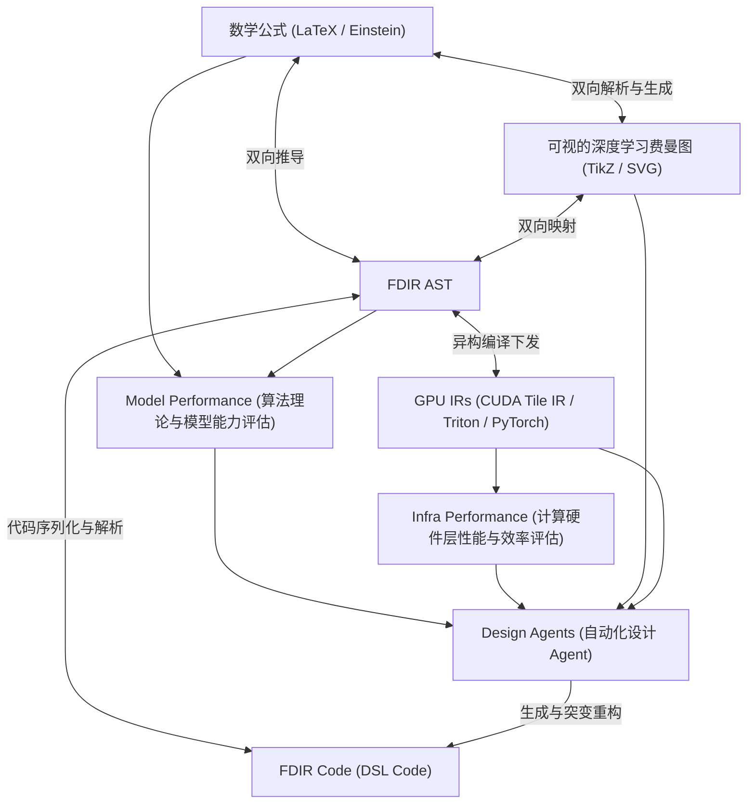

# 深度学习图式中间表示（FDIR）：双重闭环矩阵、算法原理与异构 GPU 编译下发指南

> **Feynman Diagrammatic Intermediate Representation (FDIR)**  
> **版本**：v2.1.0 (Closed-Loop Matrix Architecture with GPU Profiling)  
> **文档定位**：理论推导 + 闭环矩阵拓扑规约 + 异构 GPU 编译下发 + 智能体设计环境接口 + API 使用手册  

---

## 目录

1. [引言与矩阵系统拓扑 (Motivation & Ecosystem Topology)](#1-引言与矩阵系统拓扑-motivation--ecosystem-topology)
   - 1.1 闭环双向映射矩阵 (Closed-Loop Mapping Matrix)
   - 1.2 结合 NVIDIA CUDA Tile IR 与 OpenAI Triton 的背景
2. [多模态表征转换原理 (Multi-Modal Representation Converters)](#2-多模态表征转换原理-multi-modal-representation-converters)
   - 2.1 数学公式与 FDIR AST 双向映射 (`FormulaMapper`)
   - 2.2 物理费曼图渲染器 (`FeynmanVisualizer`)
   - 2.3 AST 与 Python DSL 代码双向序列化 (`FDIRCodeGen`)
3. [双重性能评估与物理 GPU 剖析 (Performance Evaluation & GPU Telemetry)](#3-双重性能评估与物理-gpu-剖析-performance-evaluation--gpu-telemetry)
   - 3.1 算法/模型层性能评估 (`ModelPerformanceEvaluator`)
   - 3.2 硬件/计算层屋顶模型评估 (`InfraPerformanceEvaluator`)
   - 3.3 物理 GPU 性能分析器 (`GPUProfiler`)
4. [异构 GPU IR 下发编译器后端 (Heterogeneous GPU Lowering Backends)](#4-异构-gpu-ir-下发编译器后端-heterogeneous-gpu-lowering-backends)
   - 4.1 PyTorch 原生 Module 下发 (`TorchLowering`)
   - 4.2 NVIDIA CUDA Tile IR (`cuda::tile`) 编译下发 (`TileIRLowering`)
   - 4.3 OpenAI Triton (@triton.jit) JIT Kernel 编译下发 (`TritonLowering`)
5. [自主架构设计 Agent 接口 (Autonomous Design Agent Environment)](#5-自主架构设计-agent-接口-autonomous-design-agent-environment)
   - 5.1 观察-突变循环 (`Observe-Mutate Cycle`)
   - 5.2 结构突变算子与反馈回路
6. [端到端 Demo 与 API 手册 (Step-by-Step API & Pipeline Demo)](#6-端到端-demo-与-api-手册-step-by-step-api--pipeline-demo)
7. [更新日志与演进待办 (Roadmap & Changelog)](#7-更新日志与演进待办-roadmap--changelog)

---

## 1. 引言与矩阵系统拓扑 (Motivation & Ecosystem Topology)

### 1.1 闭环双向映射矩阵 (Closed-Loop Mapping Matrix)
FDIR 提供了一个构建在多模态表征、双重性能评估与 Agent 自动进化上的**闭环矩阵系统拓扑（Closed-Loop Ecosystem Matrix）**：




---

## 2. 多模态表征转换原理 (Multi-Modal Representation Converters)

### 2.1 数学公式与 FDIR AST 双向映射 (`FormulaMapper`)
`FormulaMapper` 实现了数学表达式（Einstein Notation 及 LaTeX 格式）与 FDIR 图 AST 的双向翻译：
- `einsum_to_diagram("ik,kj->ij; ij,jl->il")` 解析链式矩阵缩并；
- `diagram_to_latex()` 将计算图逆向推导导出为对应 LaTeX 公式（如 $y = \text{LayerNorm}(\text{Softmax}(\dots)V + x)$）。

### 2.2 物理费曼图渲染器 (`FeynmanVisualizer`)
- `to_tikz()` 导出符合物理学术规范的 LaTeX `tikz-feynman` 代码（包含费米子实线箭头、玻色子/Attention 虚线/波浪线、相互作用顶点 Blob）；
- `to_svg()` & `to_html()` 导出带颜色的矢量图与交互式 Web 网页。

---

## 3. 双重性能评估与物理 GPU 剖析 (Performance Evaluation & GPU Telemetry)

FDIR 提出了 **Dual Performance Feedback Loop**：
1. **Model Performance Report**：计算模型参数量、激活量、长程依赖能力（Receptive Field）、序列缩放复杂度 $O(S^2 \cdot D)$ 与参数效率；
2. **Infra Performance Report**：基于 GPU Roofline Model 评估总 FLOPs、HBM 读写 traffic、算术强度（FLOPs/Byte）、SRAM 耗费，并自动判定计算瓶颈是 **Compute-bound** 还是 **Memory-bound**；
3. **GPU 物理性能剖析 (`GPUProfiler`)**：使用 PyTorch CUDA Events 实时提取 GPU 执行时间，结合 `max_memory_allocated` 获取运行时显存分配情况，并将其与静态仿真性能一同输入给优化智能体。

---

## 4. 异构 GPU IR 下发编译器后端 (Heterogeneous GPU Lowering Backends)

### 4.1 NVIDIA CUDA Tile IR (`cuda::tile`) 编译下发
根据 NVIDIA 的 [CUDA Tile IR 规范](https://docs.nvidia.com/cuda/tile-ir/)，`TileIRLowering` 将 FDIR Vertex 映射为块化 Tile 原语：
```cpp
// 自动生成的 NVIDIA CUDA Tile IR Pseudocode
tile<float, 128, 128> acc = 0.0f;
for (int k_tile = 0; k_tile < K_TOTAL; k_tile += 32) {
    tile<half, 128, 32> tile_a = load(ptr_A);
    tile<half, 32, 128> tile_b = load(ptr_B, layout::col_major());
    mma(acc, tile_a, tile_b, acc); // Tensor Core HW MMA
}
```

### 4.2 OpenAI Triton (@triton.jit) 编译下发
`TritonLowering` 生成 Python Triton JIT 内核与 Launcher 引导函数，包含基于块指针（Block Pointers）的载入、Online Softmax 计算与 Tensor Core 点积。

---

## 5. 自主架构设计 Agent 接口 (Autonomous Design Agent Environment)

`DesignAgentInterface` 为 LLM / RL 驱动的架构搜索 Agent 提供了环境交互接口：
- **`observe()`**：读取当前计算图摘要、Model + Infra 双重性能报告以及 GPU 物理性能剖析遥测指标；
- **`mutate(action)`**：执行包括增加缩并/Attention、擦除节点、融合算子、调整硬件 Tile 大小与切换 Norm 类型在内的突变算子，形成闭环。

---

## 6. 端到端 Demo 与 API 手册 (Step-by-Step API & Pipeline Demo)

运行闭环矩阵 Demo 与测试集：

```bash
# 1. 运行 26 项自动化单元测试集
python -m pytest Feynman/tests/ -v

# 2. 运行端到端闭环生态 Demo
python Feynman/examples/closed_loop_ecosystem_demo.py
```

---

## 7. 更新日志与演进待办 (Roadmap & Changelog)

项目的详细历史更新日志与未来演进规划待办已统一归档至独立文档，请查阅：  
🔗 **[更新日志与演进待办汇总 (ROADMAP_CHANGELOG_ZH.md)](ROADMAP_CHANGELOG_ZH.md)**
