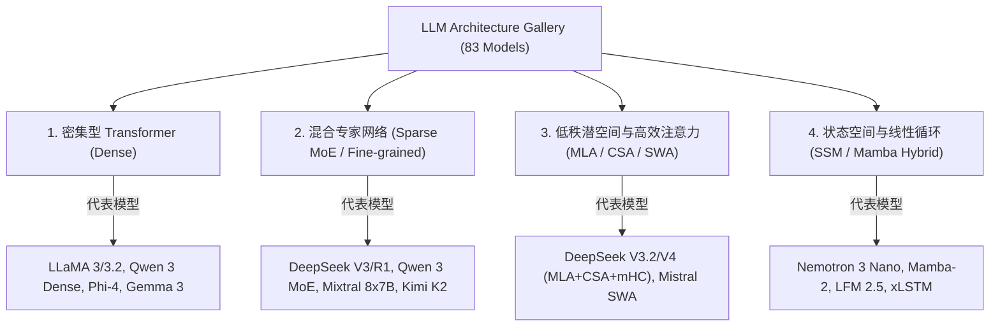
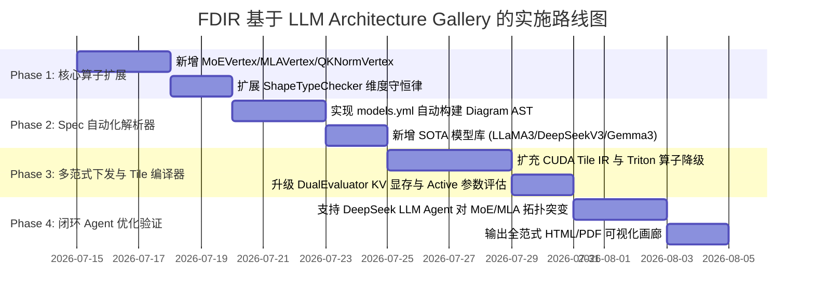

# 基于 SOTA 大模型架构图谱 (LLM Architecture Gallery) 的 FDIR 实现方案计划

> **Feynman Diagrammatic Intermediate Representation (FDIR)**  
> **理论依据**：针对 [Sebastian Raschka - LLM Architecture Gallery](https://sebastianraschka.com/llm-architecture-gallery/)（开源仓库 `repos/llm-architecture-gallery`）中涵盖的 **83 款业界主流/前沿大语言模型架构**进行深层次工程剖析，制定 FDIR 编译器引擎与 Agent 系统的扩展实施计划。

---

## 1. 调研分析与 SOTA 架构范式归演

对 `llm-architecture-gallery/models.yml` 及 82 份 WebP 物理架构拓扑图的分析表明，现代大语言模型（LLM）已从早期单一的标准 MHA + Dense Feed-Forward Transformer 演变为以下 **四大计算拓扑范式**：



### 1.1 四大关键计算范式的结构特征
1. **密集型 Transformer (Dense Transformer)**：
   - *特征*：RMSNorm 前置归一化、Grouped-Query Attention (GQA)、SwiGLU 激活前馈网；
   - *演进点*：引入 **QK-Norm / QK-LayerNorm**（如 Gemma 3, Arcee Trinity）在 Softmax 前点积归一化，防止注意力 Logits 爆音。
2. **细粒度混合专家网络 (Fine-grained Sparse MoE)**：
   - *特征*：将标准 FFN 拆解为数十/数百个粒度更小的 Routed Experts，并设立 1 个或多个不参与路由的 **Shared Experts**（如 DeepSeek V3 671B/37B active, Qwen 3 MoE）；
   - *演进点*：Hash-based Routing、Auxiliary-loss-free 负载均衡控制。
3. **低秩压缩潜空间与超连接 (MLA, CSA & mHC)**：
   - *特征*：**DeepSeek MLA (Multi-Head Latent Attention)** 通过低秩矩阵投影将 KV Cache 压缩数倍；**CSA/HCA** 在百万 Token 场景下实施稀疏注意力；
   - *演进点*：**mHC (Manifold-Constrained Hyper-Connections)** 在 DeepSeek V4 中引入多流残差拓扑。
4. **状态空间与 Recurrent 混合架构 (SSM Hybrid)**：
   - *特征*：交替堆叠 Mamba/SSM 块与 Transformer Attention 块（如 Nemotron 3, LFM 2.5, Kimi Linear），打破序列二次方复杂度 $O(S^2)$ 限制。

---

## 2. FDIR 核心节点基元扩展计划 (Node Primitives Expansion)

为精准表达上述范式，需在 `Feynman.fdir.nodes` 中新增以下 5 种相互作用顶点（Interaction Vertices）：

### 2.1 混合专家顶点 (`MoEVertex`)
- **表达逻辑**：输入张量 $x \in (B, S, D)$，通过 Gate 路由函数选择 $Top-K$ 个 Routed Experts 并与 Shared Expert 输出按权重加权融合：
  $$y = \text{Expert}_{\text{shared}}(x) + \sum_{i \in TopK} g_i \cdot \text{Expert}_i(x)$$
- **FDIR 属性**：`num_experts`, `top_k`, `num_shared_experts`, `routed_dim`。

### 2.2 低秩潜空间注意力顶点 (`MLAVertex`)
- **表达逻辑**：包含 Query/Key/Value 的潜空间低秩压缩 $c_t^{KV} = W^{DKV} x_t$，支持 RoPE 解耦：
  $$K_t = W^{UK} c_t^{KV}, \quad V_t = W^{UV} c_t^{KV}$$
- **FDIR 属性**：`kv_compression_dim`, `qr_compression_dim`, `rope_dim`。

### 2.3 QK 正则化顶点 (`QKNormVertex`)
- **表达逻辑**：在注意力 Shrinkage 前，对点积前 $Q, K$ 张量施加 Vector RMSNorm：
  $$\hat{Q} = \text{RMSNorm}(Q), \quad \hat{K} = \text{RMSNorm}(K)$$
- **FDIR 属性**：`norm_type`, `eps`。

### 2.4 流形约束超连接顶点 (`HyperConnectVertex`)
- **表达逻辑**：表达 DeepSeek V4 / mHC 的多通道残差向量流，支持多流信号相加与超图控制。
- **FDIR 属性**：`stream_count`, `hyper_dim`。

### 2.5 状态空间循环顶点 (`SSMVertex`)
- **表达逻辑**：表达 Mamba-2 选通状态空间块（Selective State-Space Model），支持 1D 卷积与递归选择性状态更新。
- **FDIR 属性**：`d_state`, `d_conv`, `expand_factor` Adapter。

---

## 3. 从 `models.yml` 到 FDIR AST 的自动化反编译配置 (Gallery Spec Parser)

计划在 `FormulaMapper` 中引入自动化 Spec 解析模块，能够直接读取 `models.yml` 中的元数据并动态构建各 SOTA 模型的 FDIR AST：

```python
# 拟实现 API 规范
class FormulaMapper:
    @staticmethod
    def from_gallery_spec(model_name: str,
                           num_layers: int = 2,
                           seq_len: int = 128) -> Diagram:
        """从 Gallery 配置模型库中构建如 DeepSeek-V3/V4, Qwen-3, Gemma-3, Mixtral 的标准 FDIR AST."""
        pass
```

---

## 4. 评估引擎与异构编译后端升级 (Evaluation & Lowering Upgrade)

### 4.1 双重性能评估引擎 (DualEvaluator) 升级
1. **模型容量 (Model Capacity)**：
   - 区分 **Total Parameters** 与 **Active Parameters**（如 DeepSeek V3 Total 671B vs Active 37B）；
   - KV Cache 显存占用计算精准对齐：
     - MHA: $2 \cdot B \cdot S \cdot N_{\text{layers}} \cdot H \cdot D_{\text{head}} \times \text{Bytes}$
     - MLA: $B \cdot S \cdot N_{\text{layers}} \cdot D_{\text{latent}} \times \text{Bytes}$ (可节省高达 $70\%\sim 90\%$ KV 显存)
2. **计算硬件层 (Infra Roofline Model)**：
   - 加入 MoE Gather/Scatter 路由的显存 Traffic 开销；
   - 自动诊断路由负载不均（Load Imbalance）造成的 GPU Tensor Core 空闲。

### 4.2 异构硬件下发后端 (CUDA Tile IR & Triton) 升级
- **`TileIRLowering`**：
  - 为 `MoEVertex` 下发基于 `cuda::tile` 的 Tiled Router 向量分支；
  - 为 `MLAVertex` 下发低秩矩阵乘与在线解压mma拼接内联代码；
- **`TritonLowering`**：
  - 下发基于 Triton `tl.swizzle` 与 Block Pointer 的 Top-K 专家点积 JIT 源码。

---

## 5. 分阶段实施路线图 (Phase-by-Phase Implementation Roadmap)



### 具体阶段分解：

#### **Phase 1: 核心算子与维度守恒扩展 (Week 1)**
- 在 `Feynman.fdir.nodes` 中实现 `MoEVertex`, `MLAVertex`, `QKNormVertex`, `SSMVertex`；
- 在 `ShapeTypeChecker` 中扩充对应算子的 Input/Output 维度守恒规则。

#### **Phase 2: Gallery 自动化架构解析器 (Week 2)**
- 编写 `gallery_parser.py` 解析器，读取 `llm-architecture-gallery/models.yml`；
- 在 `FormulaMapper` 中提供 `from_gallery_spec()` 接口，一键拉起任意 83 款模型的完整 FDIR 图。

#### **Phase 3: 硬件 Tile IR 下发与性能剖析升级 (Week 3)**
- 扩充 `TileIRLowering` 与 `TritonLowering` 针对 MoE 与 MLA 的块化生成模版；
- 升级 `DualEvaluator`，准确统计 Active vs Total Params、KV Cache 节省比例与算术强度。

#### **Phase 4: 全范式端到端闭环优化 (Week 4)**
- 在 `examples/` 下编写 `llm_gallery_ecosystem_demo.py`，展示从模型解析、费曼图渲染、物理 GPU 剖析到 DeepSeek Agent 调优的全流程；
- 生成支持高分辨率动态 Scaling 的 PDF 与 SVG 架构画廊制品。

---

## 6. 关联引用与统一文档索引

本计划书已纳入 FDIR 项目体系架构。相关更新历史与演进待办关联查阅：
- 🔗 **[更新日志与未来演进待办 (ROADMAP_CHANGELOG_ZH.md)](ROADMAP_CHANGELOG_ZH.md)**
- 🔗 **[FDIR 整体架构与使用指南 (FDIR_Architecture_and_Usage_Guide.md)](FDIR_Architecture_and_Usage_Guide.md)**
- 🔗 **[FDIR 项目 API 中文说明 (API_Code_Reference_ZH.md)](API_Code_Reference_ZH.md)**
